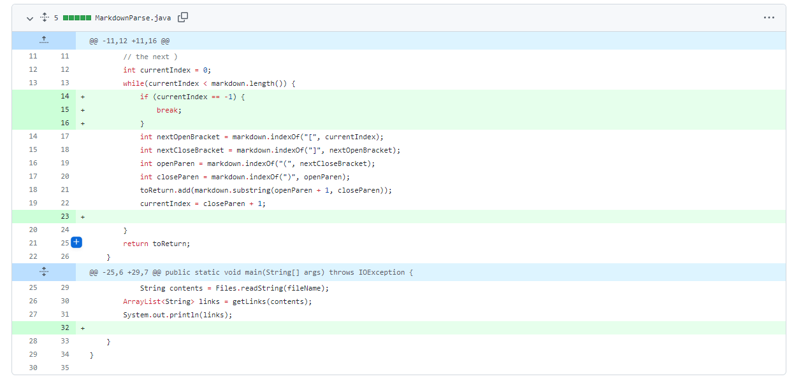
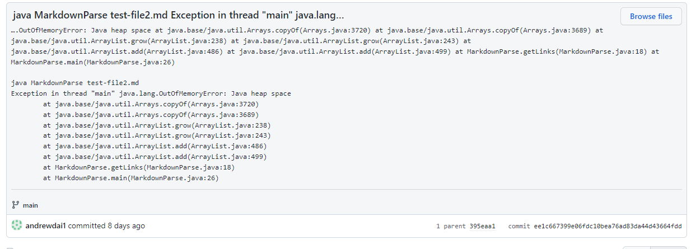
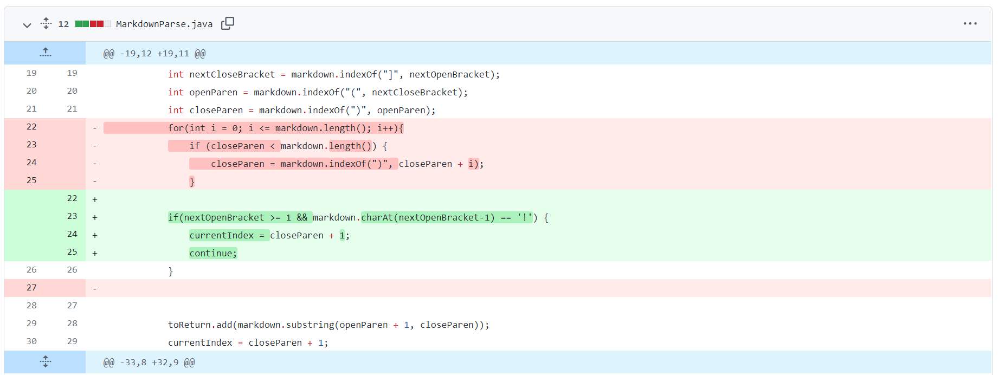
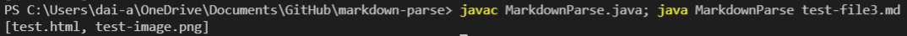
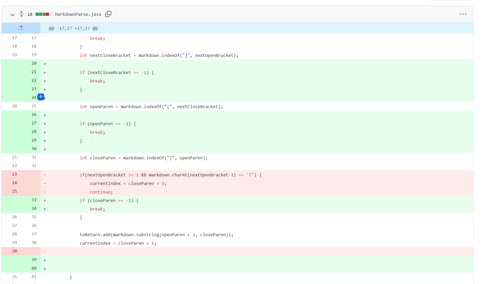
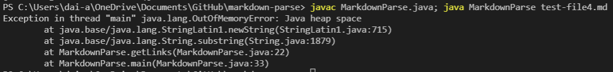

# Lab Report Week 4
## Andrew Dai A16366706
---
---
## Code Change 1
**Bug fix 1:**

[Link to test file 1](https://github.com/andrewdai1/cse15l-lab-reports/blob/main/test-file2.md)

**Error message:**

**Explanation:**
The bug was due to the program assuming that everything is a 
link: when it encountered a markdown file with extra text 
("hello!" in this case), it kept on looping forever trying to 
find the next open bracket.
This caused Java to go into an infinte loop and run out of 
memory, resulting in an error message.

## Code Change 2
**Bug fix 2:**

[Link to test file 2]()

**Wrong output:**

**Explanation:**
The symptom was the program printing out an image link if there
was a link to an image in the markdown file. The bug was that
the program treated images and links the same way. This was 
fixed by checking for an exclamation mark which indicated that
the link was an image and not an actual link.

## Code Change 3
**Bug fix 3:**

[Link to test file 2]()

**Error output:**

**Explanation:**
The symptom was another error message saying that Java ran out
of memory. This is because of a bug where, if there was text 
inside brackets after a link, the program would go into an 
infinte loop trying to find the next open parentheses.
