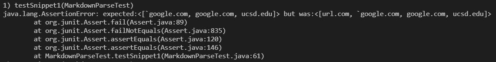

# Lab Report 4 Week 8
## Andrew Dai A16366706
---
**Snippet 1**

Snippet 1 should produce a list of 3 links: 
`google.com, google.com, and ucsd.edu.
This is how I tested it for both implementations:

Testing with my implementation:

My code did not give the correct links.

Testing with the group I reviewed's implementation:

Their code did not give the correct links.

---

**Snippet 2**

Snippet 2 should produce 3 links:
a.com, a.com(()), and example.com.

This is how I tested it for both implementations:

Testing with my implementation:

My code did not give the correct links.

Testing with the group I reviewed's implementation:

Their code did not give the correct links.

---

**Snippet 3**

Snippet 1 should produce 1 link:
https://ucsd-cse15l-w22.github.io/.

This is how I tested it for both implementations:

Testing with my implementation:

My code did not give the correct link.

Their code did not give the correct links.

Testing with the group I reviewed's implementation:

---

**Fixing code**

For snippet 1, I would need to check for tickmark characters in the code. If there are ticks, it should ignore the stuff between the ticks and continue after the last tick, or if there is only one tick, continue from the first tick. However, the code should also check if all the ticks are in between the outermost open and closed brackets as well, as if the ticks are in between the outermost brackets it should still count as a link. I think this could be done within 10 lines of code, but for me I think trying to find thre outermost brackets and tick marks would be difficult, and for me it would probably require more than 10 lines.

For snippet 2, I don't think I can do it within 10 lines of code. I would have to check for nested links inside brackets, because the outer link would not count while the nested link inside would count. I can't really see a way to have nested loops inside loops to check multiple times to try and find the outermost nested link. Similarly, additional parentheses in the URL would need me to check for the outermost parentheses in the link part of the markdown link, and I think that would require many lines of code for me. Finally, I think that checking for nested brackets or escaped brackets would be also challenging, especially since backslashes as a string are often treated as errors in java if they are not correct. 

For snippet 3, I think a change within 10 lines is possible for me. It seems link vscode's markdown parse does not treat a link as valid if there are multiple \n in between closed brackets and open backets, as well as multiple \n lines before or after a link inside parentheses. I think it would just need checks for new lines in between brackets and parentheses.